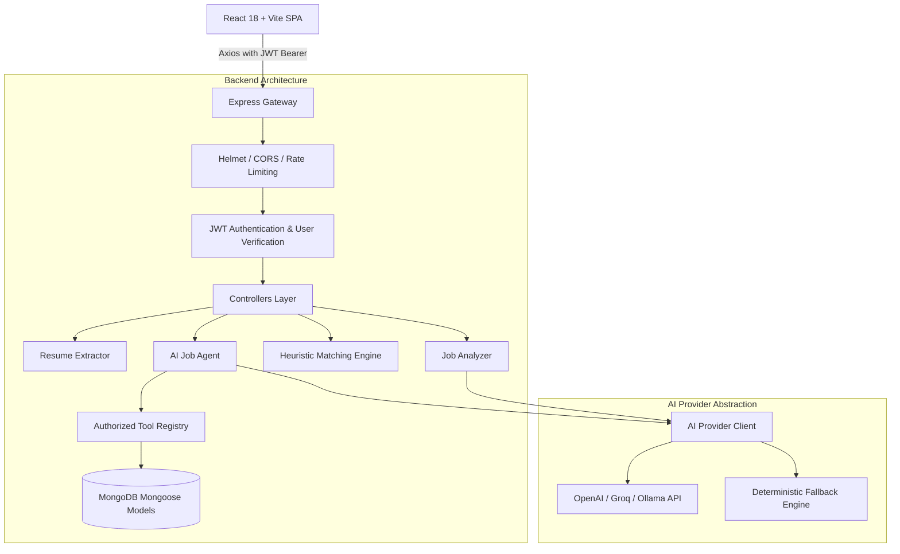

# AI Job Application Agent

A full-stack, autonomous career copilot that extracts candidate resume data, indexes job descriptions, calculates transparent compatibility heuristics, manages application tracking pipelines, and features an AI Agent equipped with controlled function/tool calling.

---

## Features

- **Document Processing**: Extracts and parses resume text from PDF (`pdf-parse`), Word DOCX (`mammoth`), and plain text formats.
- **Structured AI Profile Extraction**: Isolates programming languages, frameworks, databases, developer tools, work experience, education, and projects into structured JSON.
- **Job Posting Intelligence**: Classifies job requirements into **Required** vs. **Preferred** qualifications, years of experience, and responsibilities.
- **Transparent Compatibility Heuristics**: Compares resume skills against job requirements, exposing exact skill overlaps, missing required competencies, and relevant projects without deceptive hiring outcome predictions.
- **Application Pipeline Tracker**: Kanban-style status workflow (`Saved`, `Applied`, `Interview`, `Assessment`, `Offer`, `Rejected`, `Withdrawn`) with progress notes and history timeline.
- **Tailored Outreach Generator**: Crafts customized cover letters and application messages grounded strictly in factual resume history across selectable tones (`Professional`, `Concise`, `Friendly`).
- **Autonomous Job Agent**: Employs an LLM-driven tool-calling loop capable of reading candidate resumes, searching jobs, running compatibility checks, and updating applications with real-time UI action markers.
- **Multi-Tenant Security**: Multi-tier isolation enforcing user ownership across every database query and agent execution boundary.

---

## Architecture



---

## How the AI Agent Works

Rather than relying on keyword scripts or hardcoded if/else rules, the agent receives formal JSON Schema tool definitions and autonomously plans which tools to call.

1. **User Query**: Candidate asks a question (e.g., *"Which backend skills am I missing across my saved roles?"*).
2. **Model Planning**: The LLM determines it needs candidate information and emits a tool invocation (e.g., `getUserResume`).
3. **Authorized Execution**: The backend securely executes `executeAgentTool('getUserResume', {}, userId)`, querying MongoDB strictly for documents owned by `userId`.
4. **Context Injection**: The tool's structured output is appended back into the model's message history.
5. **Secondary Tool Call**: The model invokes `searchJobs({ query: "backend" })`, receives the roles, and compares criteria.
6. **Synthesis**: The model generates a concise response while UI badges display discrete action steps (*"Reading your resume profile"*, *"Searching saved jobs database"*).

---

## Tech Stack

- **Frontend**: React 18, Vite, JavaScript, Tailwind CSS, Lucide React, React Router 7, Axios.
- **Backend**: Node.js, Express.js (ES Modules), MongoDB, Mongoose, JWT (`jsonwebtoken`), `bcryptjs`.
- **Document Extraction**: `pdf-parse` (PDF extraction), `mammoth` (DOCX extraction), `multer` (in-memory buffer parsing).
- **AI Integration**: OpenAI SDK abstraction supporting custom endpoints (OpenAI, Groq, DeepSeek, Ollama) and deterministic heuristic fallbacks.
- **Testing**: Jest, Supertest, `mongodb-memory-server` for isolated in-memory testing.

---

## Project Structure

```
ai-job-agent/
├── client/                     # React 18 Single Page Application
│   ├── src/
│   │   ├── components/         # Reusable UI widgets, Modals, Badges, Buttons
│   │   ├── context/            # AuthContext (persistent JWT authentication)
│   │   ├── layouts/            # DashboardLayout with responsive sidebar & nav
│   │   ├── pages/              # Dashboard, Resume, Jobs, JobDetail, Applications, Agent, Settings
│   │   ├── services/           # Centralized Axios API services
│   │   ├── utils/              # Status color constants and date formatters
│   │   ├── App.jsx             # React Router hierarchy & ProtectedRoute wrappers
│   │   └── main.jsx            # React root mount
│   ├── package.json
│   └── vite.config.js
│
├── server/                     # Express.js REST API & AI Agent Engine
│   ├── src/
│   │   ├── agents/             # Autonomous agent loop orchestrator (jobAgent.js)
│   │   ├── config/             # Environment & MongoDB connection manager
│   │   ├── controllers/        # Express route handlers
│   │   ├── middleware/         # Auth, Upload, Rate Limiting, Error handling
│   │   ├── models/             # Mongoose schemas (User, Resume, Job, Application, Agent)
│   │   ├── routes/             # REST API routes
│   │   ├── services/           # AI provider abstraction, matching heuristic, message generator
│   │   ├── tools/              # Controlled agent tools & function definitions
│   │   ├── utils/              # File parsers, structured logger, API response helpers
│   │   ├── validators/         # Request body validation schemas
│   │   ├── app.js              # Express app configuration
│   │   └── server.js           # Server listen entrypoint
│   ├── tests/                  # Integration test suite (Auth, Jobs, Resume, Matching, Agent Tools)
│   └── package.json
│
├── docs/                       # Architectural & Technical Documentation
│   ├── architecture.md         # System design, data relationships, security model
│   ├── api.md                  # REST API reference specification
│   └── agent.md                # Agent tool execution sequence & guardrails
│
├── .env.example                # Documented configuration template
├── .gitignore                  # Git ignore rules for node_modules, logs, and artifacts
├── package.json                # Root workspace orchestration script
└── README.md                   # Project documentation
```

---

## Environment Variables

Copy `.env.example` to `.env` in the root or `server/` directory:

```bash
cp .env.example .env
```

| Variable | Description | Default |
| :--- | :--- | :--- |
| `PORT` | Backend server port | `5000` |
| `NODE_ENV` | Application environment (`development` / `production`) | `development` |
| `MONGODB_URI` | MongoDB connection string | `mongodb://127.0.0.1:27017/ai_job_agent` |
| `JWT_SECRET` | Secret key used to sign JWT session tokens | `super_secret_jwt_key_...` |
| `JWT_EXPIRES_IN` | Session duration | `7d` |
| `AI_PROVIDER` | LLM service provider (`gemini` or `openai`) | `gemini` |
| `AI_API_KEY` | API key for Google Gemini or OpenAI | *(Optional; deterministic fallback mode enabled if omitted)* |
| `AI_MODEL` | Target language model | `gemini-1.5-flash` (or `gpt-4o-mini` if using OpenAI) |
| `AI_BASE_URL` | Base URL for LLM provider endpoint | `https://generativelanguage.googleapis.com/v1beta/openai/` |
| `CLIENT_URL` | Allowed client origin for CORS | `http://localhost:5173` |

---

## Installation & Running Locally

### Prerequisites
- Node.js `>= 18.0.0`
- MongoDB running locally or a MongoDB Atlas connection URI

### 1. Install Dependencies
Install all workspace dependencies across root, server, and client:

```bash
npm run install:all
```

### 2. Start the Backend Server
In a terminal:

```bash
cd server
npm run dev
```
The server will start on `http://localhost:5000`. Verify with:
```bash
curl http://localhost:5000/api/health
```

### 3. Start the Frontend Client
In a second terminal:

```bash
cd client
npm run dev
```
Open `http://localhost:5173` in your browser.

---

## Running Automated Tests

The backend test suite utilizes `mongodb-memory-server` to run fully isolated tests without requiring an active external database instance:

```bash
cd server
npm test
```

### Test Coverage Highlights
- **Authentication**: Registration, duplicate rejection, password hashing verification, JWT generation, and protected route access.
- **Multi-Tenant Security**: Validates that User B cannot read, update, or delete jobs, resumes, or applications created by User A.
- **Document Processing**: Text extraction and format validation for uploaded resumes.
- **Matching Service**: Accurate identification of matched skills, missing required skills, and explicit non-guarantee disclosures.
- **Agent Tools**: Isolated tool execution and authorization verification.

---

## Deployment

### Frontend (Static SPA)
Build the production bundle:
```bash
cd client
npm run build
```
The optimized bundle will be created in `client/dist`, ready for deployment to Vercel, Netlify, Cloudflare Pages, or AWS S3/CloudFront.

### Backend (Node.js Service)
Set `NODE_ENV=production` and ensure `MONGODB_URI` points to a hosted database (such as MongoDB Atlas). Start with:
```bash
cd server
npm start
```
Can be hosted on Render, Railway, AWS ECS, or Fly.io.

---

## Security Practices

- **Strict User Partitioning**: Queries enforce `userId` checks on every read and write.
- **Memory-Only File Processing**: File uploads are processed in ephemeral memory buffers without leaving temporary files on disk.
- **Rate Limiting**: Protects authentication endpoints (`30 req/15m`) and AI operations (`40 req/5m`) against brute force and cost exhaustion.
- **Secure Credentials**: Passwords hashed with bcrypt; JWTs verified with strict expiration; environment secrets excluded via `.gitignore`.

---

## Lessons Learned & Future Improvements

- **Heuristic Compatibility vs. Probability**: Framing matching as skill overlap heuristics avoids deceptive hiring guarantees while giving candidates actionable feedback.
- **Agent Action Markers**: Emitting high-level action step badges significantly improves perceived responsiveness during multi-tool execution turns without exposing sensitive chain-of-thought tokens.
- **Future Enhancements**: Direct integration with calendar APIs for interview tracking, automated email outreach draft sending, and vector embeddings for semantic job matching at scale.
