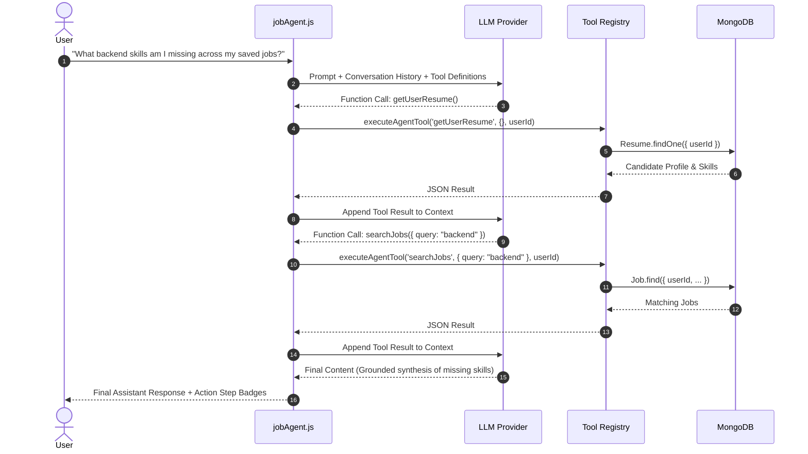

# Autonomous Job Agent Architecture & Tool Execution

## 1. Core Philosophy: Genuine Tool-Calling vs. Keyword Chatbots

The **AI Job Application Agent** does not rely on keyword heuristics or mock responses. Instead, it operates using native LLM tool/function calling protocols:

---

## 2. Controlled Execution Loop & Safety Guardrails

1. **Loop Termination Protection**: The agent loop is constrained by `MAX_TOOL_ITERATIONS = 5`. If an agent attempts excessive recursive calls, it gracefully terminates and synthesizes current state findings.
2. **Strict User Isolation**: Tools do not accept caller-specified `userId` parameters from the LLM prompt. The authenticated user ID is injected directly from the verified JWT session (`req.user._id`), guaranteeing that the agent cannot inspect or modify data outside the tenant boundary.
3. **No Chain-of-Thought Leakage**: Raw internal model reasoning or raw tool payloads are not exposed in the client UI. Instead, user-friendly action progress markers (e.g., *"Reading your resume profile"*, *"Comparing resume against job criteria"*) are published to the client.

---

## 3. Tool Registry Specification

| Tool Name | Parameters | Purpose | Authorization Policy |
| :--- | :--- | :--- | :--- |
| `getUserResume` | none | Fetches candidate parsed profile, skills, and projects | Authenticated User only |
| `searchJobs` | `query`, `limit` | Searches user's saved job opportunities | Authenticated User only |
| `getJob` | `jobId` | Retrieves job details, criteria, and match results | Document must match `userId` |
| `analyzeJobDescription` | `jobId` | Runs AI extraction of required vs preferred skills | Document must match `userId` |
| `matchResumeToJob` | `jobId` | Computes heuristic overlap between resume and role | Document must match `userId` |
| `saveJob` | `title`, `company`, `location`, `description`, `sourceUrl` | Persists a new job opportunity | Bound to `userId` |
| `updateApplicationStatus` | `jobId`, `status`, `notes` | Updates pipeline stage and appends timeline note | Bound to `userId` |
| `generateApplicationMessage` | `jobId`, `tone` | Drafts personalized cover note grounded in resume | Document must match `userId` |
| `getApplicationHistory` | none | Loads candidate application pipeline | Authenticated User only |

---

## 4. Hallucination Control & Grounding Rules

- **Zero Employment Fabrication**: The prompt strictly instructs the agent never to fabricate employer names, degrees, or certifications that do not exist in the candidate's parsed resume.
- **Explicit Missing Data Reporting**: If information is absent from the resume or job posting, the model reports that it is not listed rather than generating plausible filler.
- **Disclaimers**: Numerical match scores are framed as internal matching heuristics rather than guarantees of hiring outcomes.
