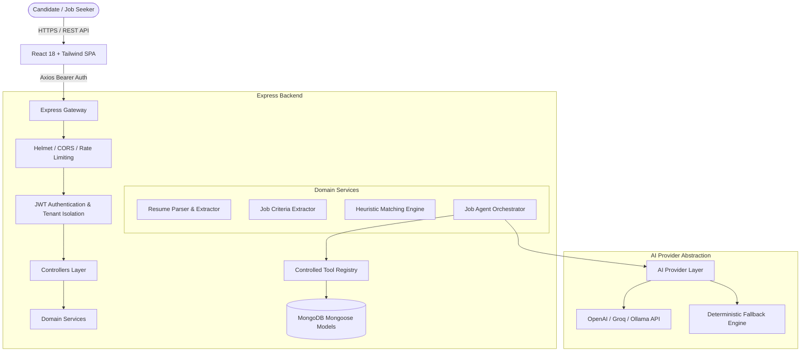
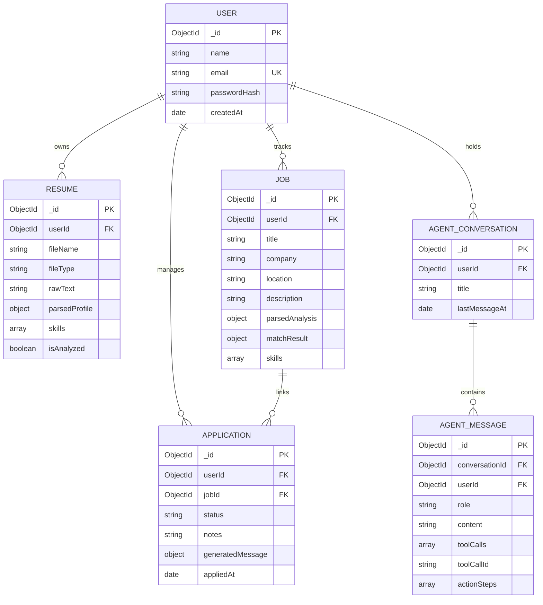

# System Architecture & Technical Design

## 1. High-Level Architectural Overview

The **AI Job Application Agent** is designed as a modular monolith adhering to clean separation of concerns, multi-tenant candidate data isolation, structured output generation, and controlled tool/function calling.

---

## 2. Component Breakdown

### Frontend (Client)
- **Framework**: React 18, Vite build tool, Tailwind CSS, Lucide icons.
- **State & Context**: `AuthContext` provides persistent token management and session recovery across browser reloads.
- **API Client**: Centralized Axios instance (`api.js`) featuring automatic JWT injection via request interceptors and centralized 401 token expiry handling.
- **Visual Design**: Professional SaaS theme with accessible dark slate surfaces, subtle interactive borders, semantic status tags, and action-oriented tool progression badges.

### Backend (Server)
- **Runtime**: Node.js (ES Modules) with Express.js.
- **Database**: MongoDB with Mongoose ODM utilizing compound indexes for tenant isolation.
- **Security Middleware**:
  - `helmet` for HTTP security headers.
  - `cors` with origin whitelisting.
  - `express-rate-limit` partitioned into general (`200 req/15m`), auth (`30 req/15m`), and AI (`40 req/5m`) limiters.
- **Error Handling**: Centralized `errorHandler` middleware producing standardized JSON responses (`{ success: false, message, errorCode }`).

---

## 3. Database Schema & Data Relationships

---

## 4. Multi-Tenant Authorization Security

- Every database query in all controllers and tools strictly includes `{ userId: req.user._id }`.
- Even if a malicious user guesses another user's `jobId` or `resumeId`, the database query evaluates to `null`, triggering a `404 Not Found` response without leaking document existence.
- Passwords are never stored in plaintext and are hashed using bcrypt with salt rounds of 10. `User.toJSON()` explicitly strips `passwordHash` and internal versioning (`__v`).

---

## 5. Non-Hallucinatory Matching Design

1. The matching engine evaluates candidate profile skills against required and preferred job criteria.
2. It outputs transparent heuristic match percentages (0–100%) and itemizes **Matched Skills**, **Missing Required Skills**, and **Missing Preferred Skills**.
3. It includes an explicit disclaimer stating that scores represent an internal heuristic overlap, not a guarantee of employment or hiring prediction.
